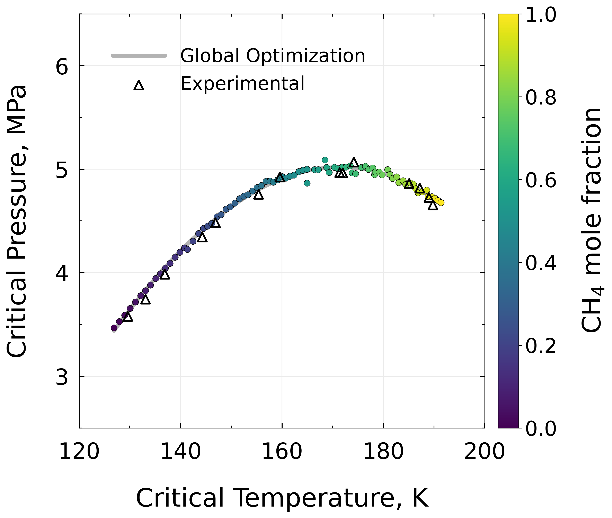

This repository is part of our manuscript on mixture critical points calculation using the Perturbed-Chain Statistical Associating Fluid Theory (PC-SAFT) Equation of State (EOS) via two distinct computational methods, namely the root-finding and optimization formulations. It specifically focuses on the computational methods and their performance comparison when combined with PC-SAFT EOS.

The repository provides reproducible code to calculate:

1. Pure-compound and multicomponent critical points
2. Binary critical loci

Two computational strategies are implemented in this study:

1. Newton–Raphson (NR) formulation of the Heidemann-Khalil (HK) criticality conditions based on PC-SAFT EOS
2. Global Optimization (GO) formulation solved with Differential Evolution (DE) based on PC-SAFT EOS

In this study, 11 pure compounds (hydrocarbon and hon-hydrocarbon) and 44 mixtures (from 2 components to 11 components) are tested. Additionally, 6 binary mixtures from a different compilations are used to build composition-dependent critical loci using both computational methods.

Note: This project implements the readily available PC-SAFT EOS from [Thermopack](https://github.com/thermotools/thermopack) and assesses the performance of two computational techniques. The model used in this work is based on original PC-SAFT EOS by Gross and Sadowski.

Sources:

[1] J. Gross, G. Sadowski, Perturbed-chain SAFT: An equation of state based on a perturbation theory for chain molecules, Ind. Eng. Chem. Res. 40 (2001) 1244–1260. https://doi.org/10.1021/ie0003887.

[2] SINTEF Energy Research, NTNU, ThermoPack [software], GitHub repository. https://github.com/thermotools/thermopack.

Pure component PC-SAFT parameters and critical data:

File: `data/pure_components_pcsaft_params.csv`

Columns:

- `Component`: identifier (Thermopack ID, e.g., C1, C2, nC4, CO2, N2)
- `m`: segment number (dimensionless)
- `sigma_A`: segment diameter [Å]
- `eps_k`: segment energy parameter [K]
- `omega`: acentric factor (dimensionless)
- `Tc_exp`: experimental critical temperature [K]
- `Pc_exp`: experimental critical pressure [MPa]
- `Source`: reference for the EOS parameters and critical data

Sources:  

[1] J. Shi, C. Wu, H. Liu, H. Li, Application of volume-translated rescaled perturbed-chain statistical associating fluid theory equation of state to pure compounds using an expansive experimental database, AIChE J. 70 (2024) e18466. https://doi.org/10.1002/aic.18466.

[2] D. Bücker, W. Wagner, A reference equation of state for the thermodynamic properties of ethane for temperatures from the melting line to 675 K and pressures up to 900 MPa, J. Phys. Chem. Ref. Data 35 (2006) 205–266. https://doi.org/10.1063/1.1859286.

[3] E.W. Lemmon, M.O. McLinden, W. Wagner, Thermodynamic properties of propane. III. A reference equation of state for temperatures from the melting line to 650 K and pressures up to 1000 MPa, J. Chem. Eng. Data 54 (2009) 3141–3180. https://doi.org/10.1021/je900217v.

[4] D. Bücker, W. Wagner, Reference equations of state for the thermodynamic properties of fluid phase n-butane and isobutane, J. Phys. Chem. Ref. Data 35 (2006) 929 1019. https://doi.org/10.1063/1.1901687.

[5] D. Ambrose, J. Walton, Vapour pressures up to their critical temperatures of normal alkanes and 1-alkanols: A critical evaluation, Pure Appl. Chem. 61 (1989) 1395–1403. https://doi.org/10.1351/pac198961081395.

[6] R. Span, W. Wagner, A new equation of state for carbon dioxide covering the fluid region from the triple-point temperature to 1100 K at pressures up to 800 MPa, J. Phys. Chem. Ref. Data 25 (1996) 1509–1596. https://doi.org/10.1063/1.555991.

[7] R. Span, E.W. Lemmon, R.T. Jacobsen, W. Wagner, A. Yokozeki, A reference equation of state for the thermodynamic properties of nitrogen for temperatures from 63.151 to 1000 K and pressures to 2200 MPa, J. Phys. Chem. Ref. Data 29 (2000) 1361–1433. https://doi.org/10.1063/1.1349047.

[8] U. Setzmann, W. Wagner, A new equation of state and tables of thermodynamic properties for methane, J. Phys. Chem. Ref. Data 20 (1991) 1061–1155. https://doi.org/10.1063/1.555898.

Multicomponent mixture:

File: `data/44_mix_dim_wen_2014.csv`  

Columns:

- `Mixture_No`: index (1–44, as in Table S1 of your manuscript)  

- `CO2`, `N2`, `C1`, `C2`, `C3`, `iC4`, `nC4`, `iC5`, `nC5`, `nC6`, `nC7`: mole fractions of each component (dimensionless).  

- Columns not used in a given mixture are left blank (or zero).  

Sources: 

[1] P. Dimitrakopoulos, W. Jia, C. Li, An improved computational method for the calculation of mixture liquid–vapor critical points, Int. J. Thermophys. 35 (2014) 865–889. https://doi.org/10.1007/s10765-014-1680-7.

Binary critical loci:

File: `data/6_binary_mix_crit_loci_hicks_young_1975.csv`

Columns:

- `Mixture`: label (e.g., C1–C2)

- `Comp_1`, `Comp_2`: component identifiers (Thermopack IDs)

- `z1`: mole fraction of `Comp\_1`

- `Tc_K`: critical temperature \\\[K]

- `Pc_MPa`: critical pressure \\\[MPa]

Sources: 
[1] C.P. Hicks, C.L. Young, Gas–liquid critical properties of binary mixtures, Chem. Rev. 75 (1975) 119–175. https://doi.org/10.1021/cr60294a001.

Example Results:

Below are representative plots generated by the example scripts implemented in this work:

  
Norm of the residuals on a log scale built using NR.

  
Objective function surface built using GO with DE.

  
GO critical loci for C1–N2 compared to the experimental critical data.

  
NR critical loci for C1–N2 compared to the experimental critical data.

  
Combined NR and GO loci for C1–N2 compared to the experimental critical data.
